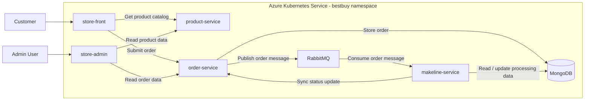

# CST8915 Final Project - Best Buy Cloud-Native Store Deployment

## Project Overview

This repository contains the Kubernetes deployment manifests for a Best Buy-inspired electronics store built as a microservice-based application and deployed to Azure Kubernetes Service (AKS).

The solution includes customer-facing and admin-facing frontends, backend APIs for product and order management, and supporting infrastructure for persistence and asynchronous processing. Orders are submitted through the storefront, stored and managed by backend services, published to RabbitMQ for decoupled processing, and monitored through the `store-admin` interface as they move through the order lifecycle.

The deployed solution includes these main application services:

- `store-front`
- `store-admin`
- `product-service`
- `order-service`
- `makeline-service`

Supporting infrastructure in this repository includes:

- MongoDB
- RabbitMQ

## Architecture Diagram



## Application Components

| Component | Description |
| --- | --- |
| `store-front` | Customer-facing web application for browsing electronics products, managing a cart, and submitting orders. |
| `store-admin` | Admin dashboard used to monitor orders, observe status changes, and review backend workflow progress. |
| `product-service` | Internal API that serves the product catalog consumed by the frontend applications. |
| `order-service` | Internal API that receives orders, manages order records, and publishes new order events to RabbitMQ. |
| `makeline-service` | Background processing service that consumes queued orders, updates workflow state, and supports order status progression. |
| MongoDB | Persistent data store used for order-related backend data. |
| RabbitMQ | Message broker used to decouple order creation from downstream asynchronous processing. |

## Deployment Files

The [`deployment-files/`](./deployment-files/) folder contains the Kubernetes manifests required to deploy the application and its supporting infrastructure to AKS.

| File | Purpose |
| --- | --- |
| [`namespace.yaml`](./deployment-files/namespace.yaml) | Creates the `bestbuy` namespace used by the solution. |
| [`configmap.yaml`](./deployment-files/configmap.yaml) | Stores shared non-secret configuration such as service URLs, MongoDB host values, and queue settings. |
| [`secret.yaml`](./deployment-files/secret.yaml) | Stores application and infrastructure credentials used by MongoDB, RabbitMQ, and backend services. |
| [`mongodb-service.yaml`](./deployment-files/mongodb-service.yaml) | Exposes MongoDB internally within the cluster. |
| [`mongodb-statefulset.yaml`](./deployment-files/mongodb-statefulset.yaml) | Deploys MongoDB with persistent storage. |
| [`rabbitmq-service.yaml`](./deployment-files/rabbitmq-service.yaml) | Exposes RabbitMQ internally on AMQP and management ports. |
| [`rabbitmq-deployment.yaml`](./deployment-files/rabbitmq-deployment.yaml) | Deploys RabbitMQ for asynchronous order messaging. |
| [`rabbitmq-enabled-plugins-configmap.yaml`](./deployment-files/rabbitmq-enabled-plugins-configmap.yaml) | Enables required RabbitMQ plugins for this project setup. |
| [`apps-all-in-one.yaml`](./deployment-files/apps-all-in-one.yaml) | Deploys all main application services and their Kubernetes Services in a single manifest. |

## Deployment Instructions

The following commands are example deployment steps for AKS and are included for documentation purposes. Replace the placeholder Azure values with your own environment details before use.

1. Connect to the Azure subscription and AKS cluster.

```bash
az login
az account set --subscription "<AZURE-SUBSCRIPTION>"
az aks get-credentials --resource-group "<AKS-RESOURCE-GROUP>" --name "<AKS-CLUSTER-NAME>"
```

2. Create the namespace and apply shared configuration.

```bash
kubectl apply -f deployment-files/namespace.yaml
kubectl apply -f deployment-files/configmap.yaml
kubectl apply -f deployment-files/secret.yaml
```

3. Deploy MongoDB.

```bash
kubectl apply -f deployment-files/mongodb-service.yaml
kubectl apply -f deployment-files/mongodb-statefulset.yaml
```

4. Deploy RabbitMQ and its plugin configuration.

```bash
kubectl apply -f deployment-files/rabbitmq-enabled-plugins-configmap.yaml
kubectl apply -f deployment-files/rabbitmq-service.yaml
kubectl apply -f deployment-files/rabbitmq-deployment.yaml
```

5. Deploy the application services.

```bash
kubectl apply -f deployment-files/apps-all-in-one.yaml
```

6. Check the deployed resources in the `bestbuy` namespace.

```bash
kubectl get pods -n bestbuy
kubectl get svc -n bestbuy
kubectl get pvc -n bestbuy
```

7. Retrieve the external access points for the frontends.

```bash
kubectl get svc store-front store-admin -n bestbuy
```

When the `EXTERNAL-IP` values are assigned, open the `store-front` and `store-admin` addresses in a browser to validate the deployed user interfaces.

## Links Table

| Component | GitHub Repository | Docker Hub Image |
| --- | --- | --- |
| `store-front-Bestbuy` | https://github.com/he000145/store-front-Bestbuy.git | `hebenben/store-front-bestbuy:v1` |
| `store-admin-Bestbuy` | https://github.com/he000145/store-admin-Bestbuy.git | `hebenben/store-admin-bestbuy:v1` |
| `product-service-Bestbuy` | https://github.com/he000145/product-service-Bestbuy.git | `hebenben/product-service-bestbuy:v1` |
| `order-service-Bestbuy` | https://github.com/he000145/order-service-Bestbuy.git | `hebenben/order-service-bestbuy:v2` |
| `makeline-service-Bestbuy` | https://github.com/he000145/makeline-service-Bestbuy.git | `hebenben/makeline-service-bestbuy:v1` |
| `8915-final-deployment` | https://github.com/he000145/8915-final-deployment.git | `N/A` |

## Demo Video

`<YOUTUBE-DEMO-LINK>`

## Demo Scope

The demo video should show:

- a short project pitch and architecture overview
- the application running on AKS, including storefront ordering and admin-side order monitoring
- a CI/CD demonstration for at least one service repository

## CI/CD Note

At least one service should demonstrate a CI/CD flow in the final project video, such as building a container image, publishing it, and deploying or updating it in AKS. This deployment repository focuses on Kubernetes manifests, so CI/CD implementation details may be maintained in one or more of the related service repositories rather than here.

## Future Improvements

- Integrate stronger secret management with Azure Key Vault or an external secrets solution.
- Add an ingress controller and TLS termination for cleaner and more secure public access.
- Introduce centralized logging, monitoring, and alerting for application and infrastructure visibility.
- Add autoscaling, health probes, and resiliency controls to improve fault tolerance.
- Harden MongoDB and RabbitMQ for more production-ready persistence, security, and backup handling.
